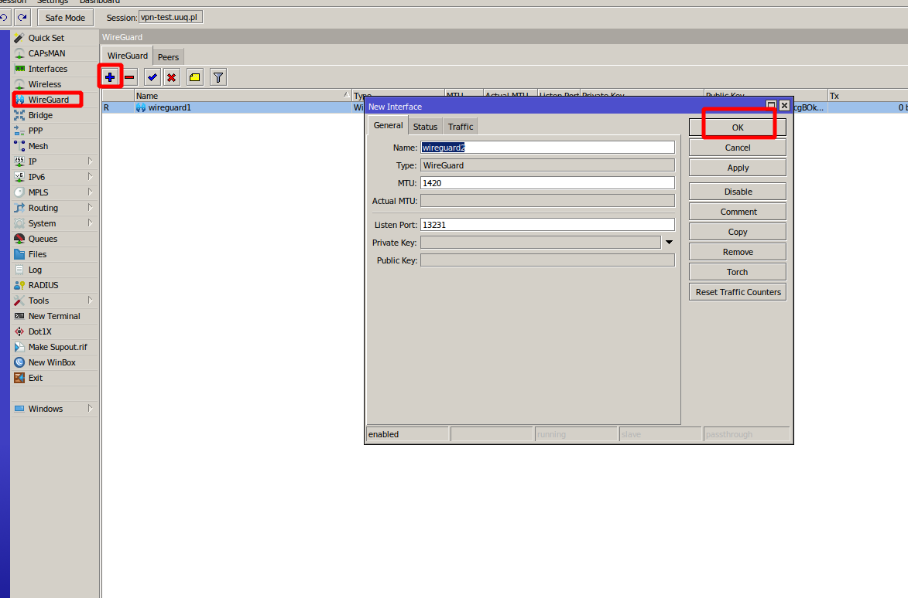

# Setup Guide: Mikrotik Preparation and Configuration

### Mikrotik WireGuard VPN module **[WHMCS](https://puqcloud.com/link.php?id=77)**
#####  [Order now](https://puqcloud.com/store/whmcs-module-mikrotik-wireguard-vpn) | [Download](https://download.puqcloud.com/WHMCS/servers/PUQ_WHMCS-Mikrotik-WireGuard-VPN/) | [FAQ](https://community.puqcloud.com/)

## Prerequisites

- **RouterOS version 7 or higher** is required.
- Access to the Mikrotik router via terminal (SSH, Winbox terminal, or WebFig terminal).

> **Important:** Enter the following commands one by one and wait for each command to complete before proceeding to the next.

---

## Step I. Check RouterOS Version

Verify that your router is running RouterOS 7 or higher:

```
system/package/print
```

---

## Step II. Create Root Certificate Authority

Create a local CA certificate for SSL:

```
/certificate add name=LocalCA common-name=LocalCA key-usage=key-cert-sign,crl-sign
```

---

## Step III. Sign the CA Certificate

```
/certificate sign LocalCA
```

---

## Step IV. Create Webfig Certificate

Replace `XXX.XXX.XXX.XXX` with the router's **public IP address**:

```
/certificate add name=Webfig common-name=XXX.XXX.XXX.XXX
```

---

## Step V. Sign the Webfig Certificate

```
/certificate sign Webfig ca=LocalCA
```

---

## Step VI. Enable SSL for the Web Interface

```
/ip service set www-ssl certificate=Webfig disabled=no
```

---

## Step VII. Enable API-SSL

```
/ip service set api-ssl certificate=Webfig disabled=no
```

---

## Step VIII. WireGuard VPN Server Setup

Create and enable the WireGuard VPN server interface through the RouterOS interface.

You can do this via Winbox or WebFig:

1. Navigate to **WireGuard** section
2. Click **Add New** (+)
3. Set the interface name (e.g., `wireguard1`)
4. Set the **Listen Port** (e.g., `13231`)
5. Enable the interface



*WireGuard interface configuration in Mikrotik WebFig*

---

## Step IX. Configure Firewall, NAT and Routing

> **Important:** Please be aware that to ensure proper functionality of VPN connections, it is essential for you, as an administrator, to correctly configure the Mikrotik router. This entails configuring **NAT**, **Firewall**, **routing**, and all the required settings for VPN to operate correctly.

Example NAT masquerade rule (adjust to your network):

```
/ip firewall nat add chain=srcnat out-interface=ether1 action=masquerade
```

Example firewall rule to allow WireGuard traffic:

```
/ip firewall filter add chain=input protocol=udp dst-port=13231 action=accept comment="Allow WireGuard"
```

---

## Next Steps

After completing the Mikrotik preparation, proceed to [Add server (router Mikrotik) in WHMCS](../03-installation-and-configuration/03-add-server.md).
