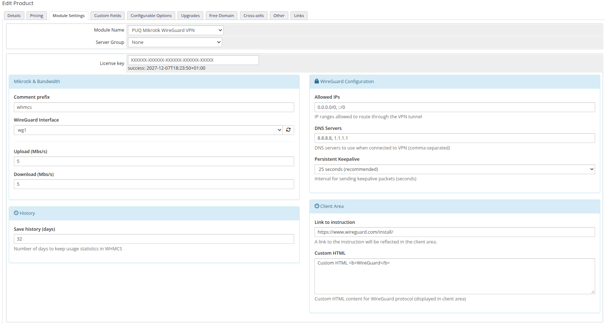
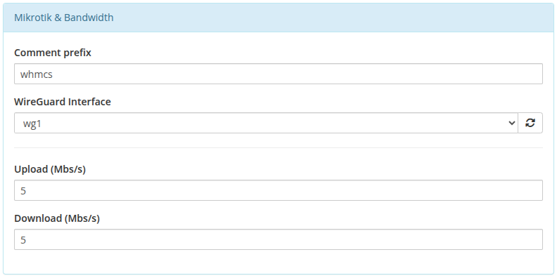
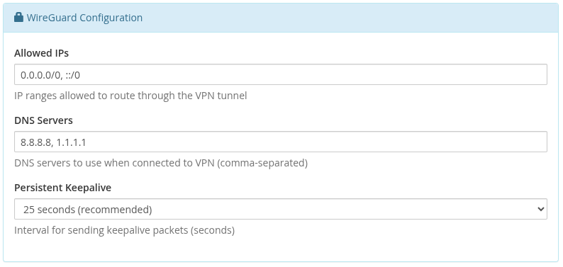
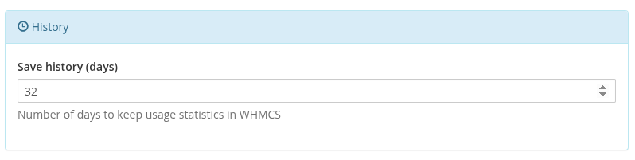
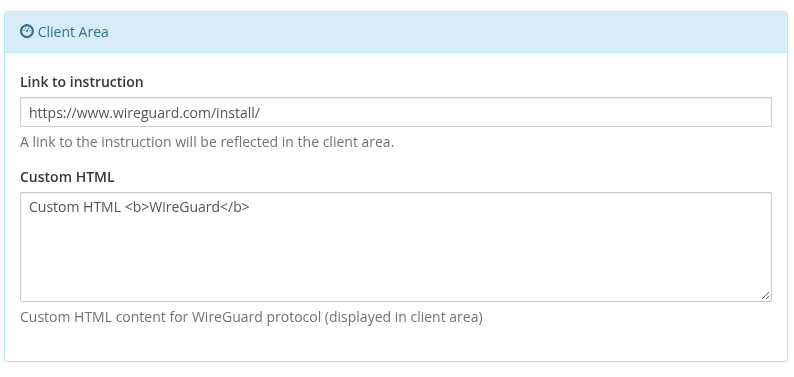
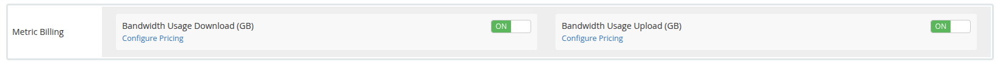
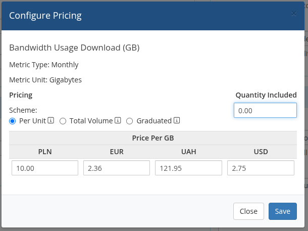

# Product Configuration

### Mikrotik WireGuard VPN module **[WHMCS](https://puqcloud.com/link.php?id=77)**
#####  [Order now](https://puqcloud.com/whmcs-module-mikrotik-wireguard-vpn.php) | [Download](https://download.puqcloud.com/WHMCS/servers/PUQ_WHMCS-Mikrotik-WireGuard-VPN/) | [Community](https://community.puqcloud.com/)

## Add new product to WHMCS

1. Log in to your WHMCS Admin Area.
2. Navigate to **System Settings** → **Products/Services** → **Create a New Product**.
3. Fill in the product details (name, description, pricing).
4. Go to the **Module Settings** tab.
5. Select **PUQ Mikrotik WireGuard VPN** from the **Module Name** dropdown.
6. Enter your **License key** in the corresponding field.
7. Configure the remaining module parameters.
8. Click **Save Changes**.

*product-configuration.png*

## Configuration parameters

| Parameter | Description | Default |
|-----------|-------------|---------|
| **License key** | Pre-purchased license key for the module. | |
| **WireGuard Interface** | Name of the WireGuard interface on the Mikrotik router (must be pre-created) | `wg1` |
| **Comment prefix** | Prefix added to VPN peer and queue comments on Mikrotik | `whmcs` |
| **Upload (Mbs/s)** | Upload bandwidth speed limit in Mbps | `5` |
| **Download (Mbs/s)** | Download bandwidth speed limit in Mbps | `5` |
| **Allowed IPs** | IP ranges allowed to route through the VPN tunnel | `0.0.0.0/0, ::/0` |
| **DNS Servers** | DNS servers to use when connected to VPN (comma-separated) | `8.8.8.8, 1.1.1.1` |
| **Persistent Keepalive** | Interval for sending keepalive packets (seconds) | `25 seconds` |
| **Disable statistics collection** | When enabled, traffic statistics will not be collected and the statistics page will be hidden from the client area | Unchecked |
| **Save history (days)** | Number of days to keep usage statistics in WHMCS (minimum 32 days) | `32` |
| **Link to instruction** | URL to setup instructions (displayed in client area as "User manual" button) | Empty |
| **Custom HTML** | Custom HTML content for WireGuard protocol (displayed in client area) | Empty |

**Allowed IPs examples:**
- `0.0.0.0/0, ::/0` — route all IPv4 and IPv6 traffic through VPN (full tunnel)
- `10.0.0.0/8, 192.168.0.0/16` — route only specific networks (split tunnel)

**Recommended:** Set "Link to instruction" to `https://www.wireguard.com/install/` — the official WireGuard client downloads page.

*product-config-mikrotik-bandwidth.png*

*product-config-wireguard.png*

*product-config-history.png*

*product-config-client-area.png*

## Metric Billing

The module supports usage-based billing through WHMCS Metric Billing. Two metrics are available:

- **Bandwidth Usage Download (GB)** — monthly download traffic in gigabytes
- **Bandwidth Usage Upload (GB)** — monthly upload traffic in gigabytes

To enable metric billing, go to the product's **Metric Billing** section and toggle the desired metrics **ON**, then click **Configure Pricing** to set the per-GB price.

*metric-billing.png*

*metric-billing-download.png*

*metric-billing-upload.png*
