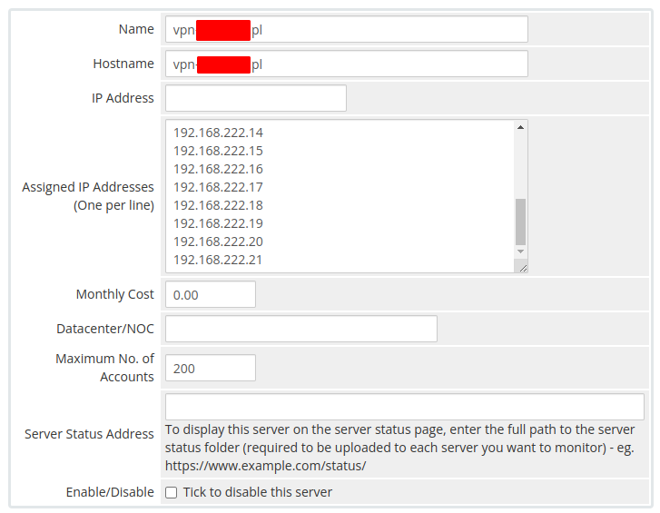
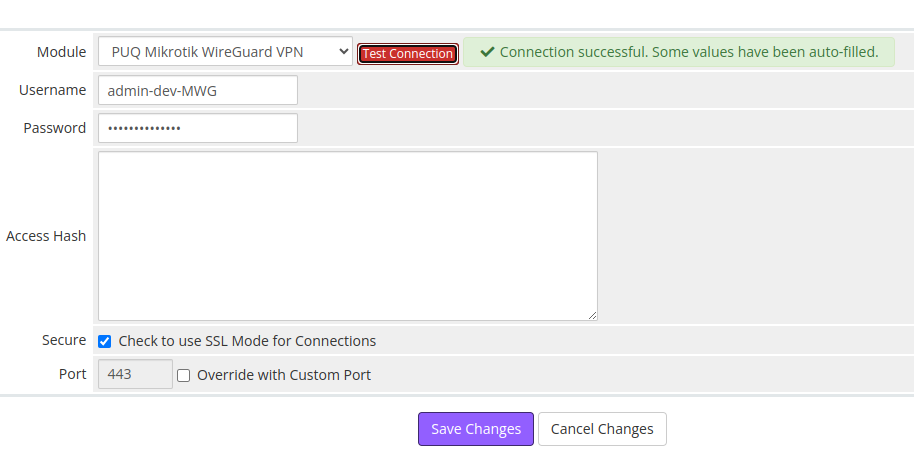

# Add Server (Router Mikrotik) in WHMCS

### Mikrotik WireGuard VPN module **[WHMCS](https://puqcloud.com/link.php?id=77)**
#####  [Order now](https://puqcloud.com/store/whmcs-module-mikrotik-wireguard-vpn) | [Download](https://download.puqcloud.com/WHMCS/servers/PUQ_WHMCS-Mikrotik-WireGuard-VPN/) | [FAQ](https://community.puqcloud.com/)

Navigate to **System Settings > Servers > Add New Server** in WHMCS admin area.

---

## Step 1: Name and Hostname

- **Name** — a descriptive name for your convenience (e.g., "Mikrotik VPN Router 1")
- **Hostname** — the hostname that resolves to your Mikrotik router's IP address (e.g., `vpn.mydomain.com`). You can also use a dedicated domain. The important thing is that the chosen hostname resolves to the IP address of the Mikrotik router in your DNS.

---

## Step 2: Assigned IP Addresses

In the **Assigned IP Addresses** field, enter a list of IP addresses that will be issued to VPN clients — one IP per line.

These IPs will be assigned to WireGuard peers as their tunnel addresses. The module automatically allocates the first available (unused) IP from this pool for each new service.

*Enter the list of IP addresses for VPN clients*

---

## Step 3: Server Details

1. Select the **"PUQ Mikrotik WireGuard VPN"** module from the Module dropdown
2. Enter the correct **username** and **password** for the Mikrotik router
3. Set the **port** (default: `443` for HTTPS REST API)
4. Check the **Secure** checkbox if using HTTPS (recommended)

*Server connection settings with module selection*

---

## Step 4: Test Connection

Click the **"Test Connection"** button to verify that WHMCS can communicate with the Mikrotik router via REST API.

A successful connection will confirm that:
- The Mikrotik router is reachable
- The credentials are correct
- The REST API is enabled and responding

---

## Next Steps

After adding the server, proceed to [Product Configuration in WHMCS](../03-installation-and-configuration/04-product-configuration.md).
