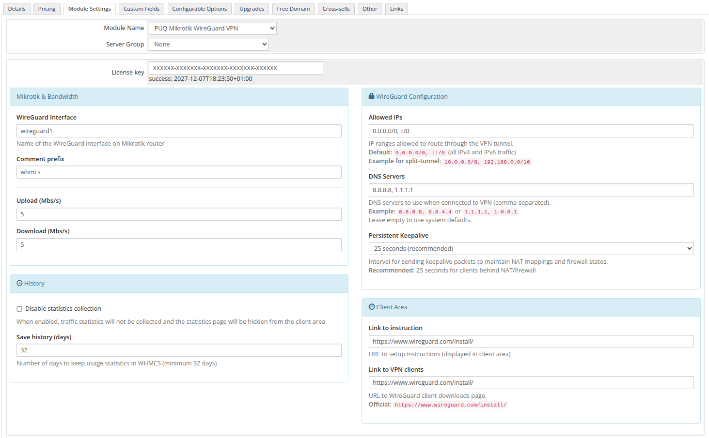
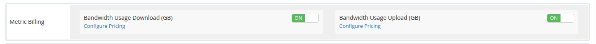

# Product Configuration in WHMCS

### Mikrotik WireGuard VPN module **[WHMCS](https://puqcloud.com/link.php?id=77)**
#####  [Order now](https://puqcloud.com/store/whmcs-module-mikrotik-wireguard-vpn) | [Download](https://download.puqcloud.com/WHMCS/servers/PUQ_WHMCS-Mikrotik-WireGuard-VPN/) | [FAQ](https://community.puqcloud.com/)

Navigate to **System Settings > Products/Services > Create a New Product** in WHMCS admin area.

Select the **"PUQ Mikrotik WireGuard VPN"** module on the **Module Settings** tab.

*Product module settings with all configuration panels*

---

## License Key

Enter a valid, pre-purchased license key for the module. The license status is displayed below the key field.

---

## Mikrotik & Bandwidth

| Field | Description | Default |
|-------|-------------|---------|
| **WireGuard Interface** | Name of the WireGuard interface on the Mikrotik router (must be pre-created) | `wireguard1` |
| **Comment prefix** | Prefix added to VPN peer and queue comments on Mikrotik | `whmcs` |
| **Upload (Mbs/s)** | Upload bandwidth speed limit in Mbps | `1` |
| **Download (Mbs/s)** | Download bandwidth speed limit in Mbps | `1` |

---

## WireGuard Configuration

These settings are included in the WireGuard client configuration file provided to customers:

| Field | Description | Default |
|-------|-------------|---------|
| **Allowed IPs** | IP ranges allowed to route through the VPN tunnel | `0.0.0.0/0, ::/0` |
| **DNS Servers** | DNS servers to use when connected to VPN (comma-separated) | `8.8.8.8, 1.1.1.1` |
| **Persistent Keepalive** | Interval for sending keepalive packets (15/25/30/60/120 seconds) | `25 seconds` |

**Allowed IPs examples:**
- `0.0.0.0/0, ::/0` — route all IPv4 and IPv6 traffic through VPN (full tunnel)
- `10.0.0.0/8, 192.168.0.0/16` — route only specific networks (split tunnel)

---

## History

| Field | Description | Default |
|-------|-------------|---------|
| **Disable statistics collection** | When enabled, traffic statistics will not be collected and the statistics page will be hidden from the client area | Unchecked |
| **Save history (days)** | Number of days to keep usage statistics in WHMCS (minimum 32 days) | `32` |

---

## Client Area

| Field | Description | Default |
|-------|-------------|---------|
| **Link to instruction** | URL to setup instructions (displayed in client area as "User manual" button) | Empty |
| **Link to VPN clients** | URL to WireGuard client downloads page (displayed as "VPN client" button) | Empty |

**Recommended:** Set "Link to VPN clients" to `https://www.wireguard.com/install/` — the official WireGuard client downloads page.

---

## Metric Billing

The module supports usage-based billing through WHMCS Metric Billing. Two metrics are available:

- **Bandwidth Usage Download (GB)** — monthly download traffic in gigabytes
- **Bandwidth Usage Upload (GB)** — monthly upload traffic in gigabytes

To enable metric billing, go to the product's **Metric Billing** section and toggle the desired metrics **ON**, then click **Configure Pricing** to set the per-GB price.

*Metric Billing settings with Download and Upload metrics enabled*
