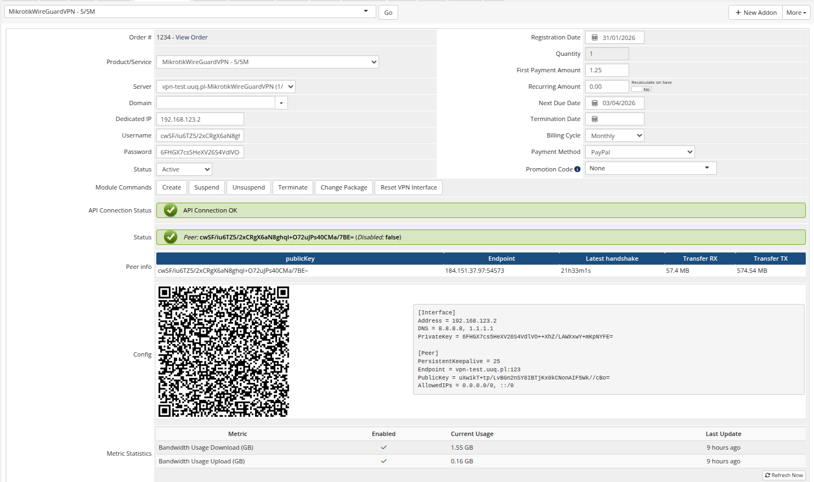

# Product Information

### Mikrotik WireGuard VPN module **[WHMCS](https://puqcloud.com/link.php?id=77)**
#####  [Order now](https://puqcloud.com/store/whmcs-module-mikrotik-wireguard-vpn) | [Download](https://download.puqcloud.com/WHMCS/servers/PUQ_WHMCS-Mikrotik-WireGuard-VPN/) | [FAQ](https://community.puqcloud.com/)

The admin service management page provides a comprehensive view of each VPN service instance.

*Admin area product information screen*

---

## License Verification

Displays the license status for the product. If the license is invalid or expired, an error message is shown.

---

## API Connection Status

Shows whether WHMCS can successfully communicate with the Mikrotik router:

- **API Connection OK** — the Mikrotik router is reachable and responding
- **API connection problem** — the router is unreachable or credentials are incorrect

---

## Peer Status

Indicates whether the WireGuard peer exists on the Mikrotik router and its current state:

- **Disabled: false** — the peer exists and is active (green indicator)
- **Disabled: true** — the peer exists but is disabled/suspended (red indicator)
- **The peer does not exist on the VPN server** — no peer found for this service

---

## Peer Info

A table displaying detailed peer information:

| Field | Description |
|-------|-------------|
| **publicKey** | The client's WireGuard public key |
| **Endpoint** | The client's current IP address and port (N/A if not connected) |
| **Latest handshake** | Timestamp of the last successful WireGuard handshake (N/A if never connected) |
| **Transfer RX** | Total data received by the peer |
| **Transfer TX** | Total data sent by the peer |

---

## Config

Displays the WireGuard client configuration in two formats:

- **QR Code** — scannable QR code image
- **Text config** — the full WireGuard configuration text

---

## Admin Actions

The following management actions are available:

| Action | Description |
|--------|-------------|
| **Create** | Generate WireGuard keys, allocate IP, create peer and bandwidth queue on Mikrotik |
| **Suspend** | Disable the WireGuard peer on Mikrotik |
| **Unsuspend** | Re-enable the WireGuard peer on Mikrotik |
| **Terminate** | Delete the peer and queue from Mikrotik, clear service data |
| **Change Package** | Update the peer's WireGuard interface and recreate the bandwidth queue with new limits |
| **Reset VPN Interface** | Temporarily disable and re-enable the peer to reset a frozen connection |
