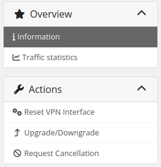

# Home Screen

### Mikrotik WireGuard VPN module **[WHMCS](https://puqcloud.com/link.php?id=77)**
#####  [Order now](https://puqcloud.com/whmcs-module-mikrotik-wireguard-vpn.php) | [Download](https://download.puqcloud.com/WHMCS/servers/PUQ_WHMCS-Mikrotik-WireGuard-VPN/) | [Community](https://community.puqcloud.com/)

Customers accessing their VPN service panel can view and manage their WireGuard VPN connection.

---

## Overview and Sidebar

The sidebar navigation provides access to:
- **Overview > Information** — the main dashboard with VPN details.
- **Overview > Traffic statistics** — daily and monthly usage graphs.
- **Actions** — quick links to reset the interface, upgrade/downgrade, or request cancellation.


*client-area-sidebar.png*

---

## Action Buttons

At the top of the main page, the following buttons are displayed:

- **User manual** — link to setup instructions (if configured by administrator)
- **Reset VPN Interface** — reboot the VPN interface to reset a frozen connection

---

## Network Configuration

Displays the VPN service status and settings:

- **Enable** — shows whether the VPN peer is enabled or disabled
- **VPN Protocol** — always "WireGuard"
- **Bandwidth download/upload** — the configured speed limits in Mb/s

---

## Connection Status

Real-time information about the VPN connection:

- **Endpoint** — the client's current IP address and port (shown when connected)
- **Latest handshake** — timestamp of the last successful WireGuard handshake
- **Transfer RX** — data received by the peer (formatted dynamically in B, KB, MB, GB, TB)
- **Transfer TX** — data sent by the peer (formatted dynamically in B, KB, MB, GB, TB)

## WireGuard Configuration

Provides the client with everything needed to configure their WireGuard client:

- **DOWNLOAD CONFIG** button — downloads the `wg0.conf` configuration file
- **Copy Configuration** button — copies the text configuration to clipboard
- **QR Code** — scannable QR code for mobile WireGuard apps
- **Configuration text** — the full WireGuard configuration in text format
- **Custom HTML** — any custom HTML content defined by the administrator

The configuration includes:

```
[Interface]
Address = <client VPN IP>
DNS = <configured DNS servers>
PrivateKey = <client private key>

[Peer]
PersistentKeepalive = <configured keepalive>
Endpoint = <server hostname>:<WireGuard listen port>
PublicKey = <server public key>
AllowedIPs = <configured allowed IPs>
```


*client-area-overview.png*

---

## Traffic Statistics

When traffic statistics collection is enabled (default), a **Traffic statistics** link appears in the sidebar navigation.

The statistics page displays two charts powered by Google Charts:

- **Traffic statistics for the last 30 days** — daily download and upload traffic in GB
- **Total traffic for all time per month** — monthly aggregated download and upload traffic in GB


*traffic-statistics.png*

> **Note:** Traffic statistics can be disabled per product in the admin settings (History > Disable statistics collection). When disabled, the sidebar link and statistics page are hidden.

---

## Usage Metrics (Metric Billing)

When WHMCS Usage-based Metric Billing is enabled for the product, clients can navigate to the **Metrics** tab alongside **Manage** in their service view:

- Displays current usage for **Bandwidth Usage Download (GB)** and **Bandwidth Usage Upload (GB)**.
- Shows pricing information per GB and when metrics were last updated.


*client-area-metrics.png*
