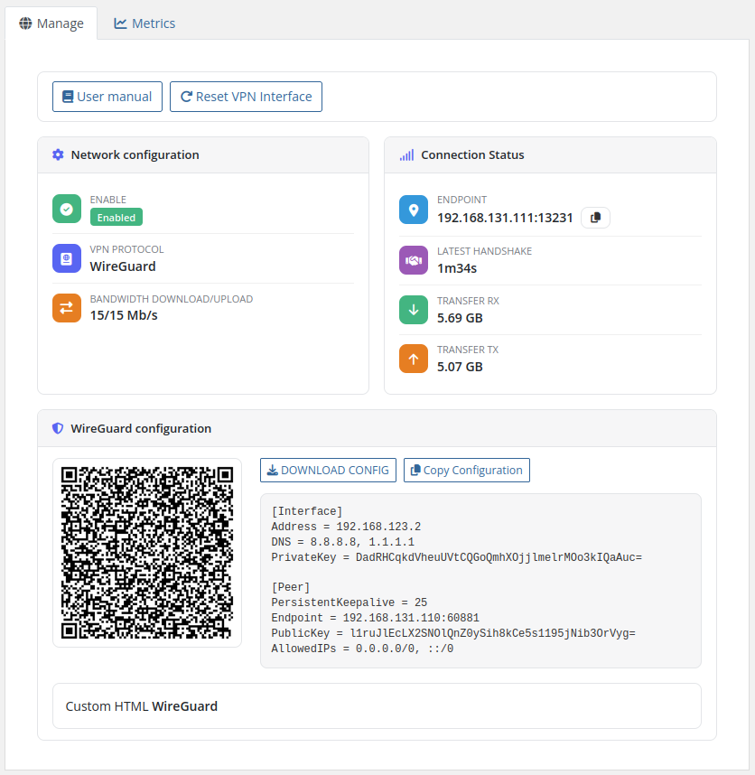
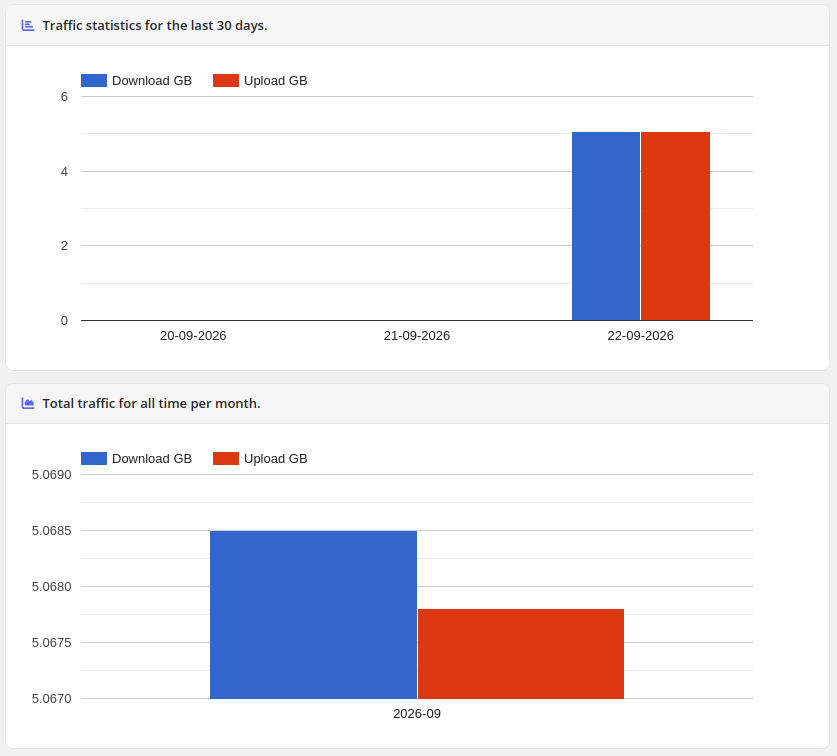
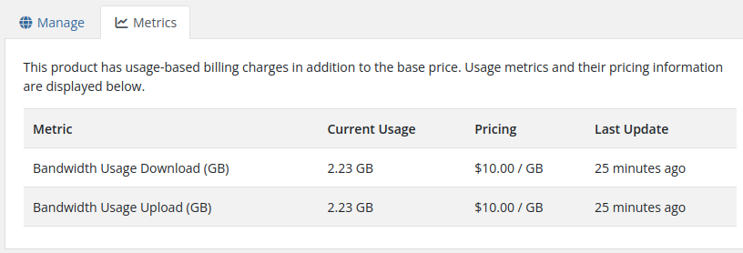
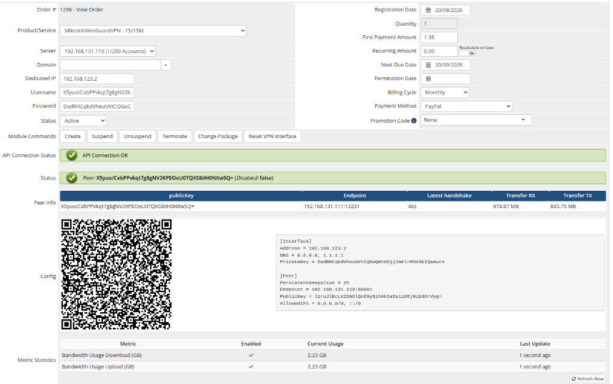

# Description

### Mikrotik WireGuard VPN module **[WHMCS](https://puqcloud.com/link.php?id=77)**
#####  [Order now](https://puqcloud.com/whmcs-module-mikrotik-wireguard-vpn.php) | [Download](https://download.puqcloud.com/WHMCS/servers/PUQ_WHMCS-Mikrotik-WireGuard-VPN/) | [Community](https://community.puqcloud.com/)

## PUQ Mikrotik WireGuard VPN — WHMCS Server Module

**PUQ Mikrotik WireGuard VPN** is a WHMCS server provisioning module for automated deployment of WireGuard VPN accounts on Mikrotik routers. The module communicates with Mikrotik via REST API and provides full lifecycle management of VPN services including creation, suspension, unsuspension, termination, and package changes.

---

## Key Features

- **Automatic WireGuard VPN provisioning** — create and deploy VPN accounts on Mikrotik routers automatically
- **Full lifecycle management** — create, suspend, unsuspend, terminate, and change packages
- **Mikrotik REST API only** — communicates exclusively via Mikrotik REST API (RouterOS 7+) with 15s connection timeout protection
- **Bandwidth speed limits** — configurable upload/download speed limits per product using Mikrotik Simple Queues
- **Private and public IP support** — assign IPs from a configurable pool per server
- **Metric billing** — post-paid usage-based billing for incoming and outgoing traffic (GB) via standard WHMCS MetricProvider
- **WireGuard configuration export** — text and dynamic QR code formats with one-click `.conf` file download
- **VPN connection status monitoring** — real-time endpoint, handshake, and transfer statistics dynamically formatted in human-readable units (B, KB, MB, GB, TB)
- **Reset VPN Interface** — disconnect and reset frozen connections from client or admin area
- **Atomic traffic statistics** — daily and monthly traffic charts with Google Charts, backed by atomic database increments (can be disabled per product)
- **Multilingual interface** — 26 languages: Arabic, Azerbaijani, Catalan, Chinese, Croatian, Czech, Danish, Dutch, English, Estonian, Farsi, French, German, Hebrew, Hungarian, Italian, Macedonian, Norwegian, Polish, Romanian, Russian, Spanish, Swedish, Turkish, Ukrainian
- **Custom links** — configurable links to setup instructions and VPN client downloads in client area

---

## Available Options in the Admin Panel

- Create / Suspend / Unsuspend / Terminate users
- Change package (update bandwidth limits and WireGuard interface)
- VPN connection status and peer information
- Reset VPN Interface function
- Text and QR code configuration display
- Metric Billing (Bandwidth Usage Download/Upload in GB)

---

## Available Options in the Client Panel

- VPN connection status (endpoint, handshake, RX/TX in human-readable units)
- Text and QR code configuration with download button
- Reset VPN Interface function
- Traffic statistics with daily and monthly charts
- Links to user manual and VPN client downloads

---

## System requirements

| Requirement | Minimum |
|-------------|---------|
| **WHMCS** | 8.x+, 9.x+ |
| **PHP** | 7.4, 8.1, 8.2, 8.3, 8.4 |
| **ionCube Loader** | v15+ |
| **Mikrotik RouterOS** | 7.x+ |

---

## Important Notes

- The upload and download speed settings in the WHMCS module register the opposite values on the Mikrotik router (e.g., download speed in WHMCS = upload speed in Mikrotik).
- To ensure proper VPN functionality, the administrator must correctly configure the Mikrotik router: NAT, Firewall, routing, and all required settings for VPN to operate correctly.

---

## Links

- **Product page:** [https://puqcloud.com/whmcs-module-mikrotik-wireguard-vpn.php](https://puqcloud.com/whmcs-module-mikrotik-wireguard-vpn.php)
- **Documentation:** [https://doc.puq.info/books/mikrotik-wireguard-vpn-whmcs-module](https://doc.puq.info/books/mikrotik-wireguard-vpn-whmcs-module)
- **Support:** [https://puqcloud.com/submitticket.php](https://puqcloud.com/submitticket.php?step=2&deptid=1)
- **Community:** [https://community.puqcloud.com/](https://community.puqcloud.com/)

---

## Screenshots

### Client area — Overview

*client-area-overview.png*

### Client area — Traffic statistics

*traffic-statistics.png*

### Client area — Usage metrics

*client-area-metrics.png*

### Admin area — Product information

*admin-product-info.png*
